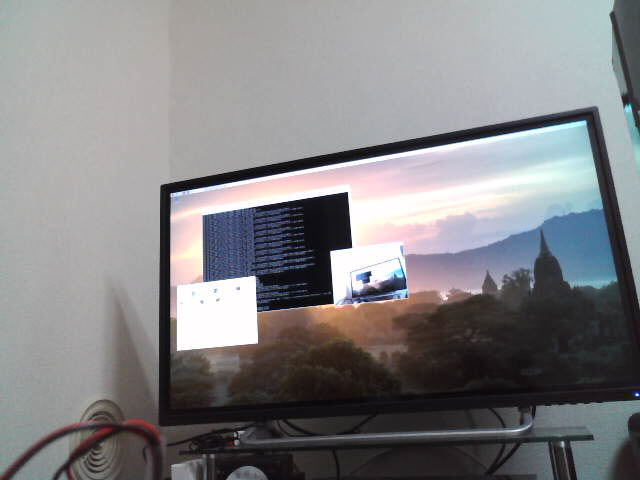

# RaspberryPi4-Webcam

Raspberry Pi 4 で UVC 対応 Web カメラを使う

---

## 1. OS バージョンなどの前提

```sh
$ cat /etc/debian_version
```

> 10.2

```sh
$ cat /etc/debian_version
```

> PRETTY_NAME="Raspbian GNU/Linux 10 (buster)"
>
> NAME="Raspbian GNU/Linux"
>
> VERSION_ID="10"
>
> VERSION="10 (buster)"
>
> VERSION_CODENAME=buster
>
> ID=raspbian
>
> ID_LIKE=debian
>
> HOME_URL="http://www.raspbian.org/"
>
> SUPPORT_URL="http://www.raspbian.org/RaspbianForums"
>
> BUG_REPORT_URL="http://www.raspbian.org/RaspbianBugs"

## 2. Raspberry Pi の USB に Web カメラを接続する

## 3. 認識されているか確認する

```sh
$ lsusb
```

> Bus 003 Device 001: ID 1d6b:0002 Linux Foundation 2.0 root hub
>
> Bus 002 Device 001: ID 1d6b:0003 Linux Foundation 3.0 root hub
>
> Bus 001 Device 004: ID 0566:3029 Monterey International Corp.
>
> Bus 001 Device 003: ID 093a:2521 Pixart Imaging, Inc. Optical Mouse
>
> Bus 001 Device 005: ID 056e:701b Elecom Co., Ltd
>
> Bus 001 Device 002: ID 2109:3431 VIA Labs, Inc. Hub
>
> Bus 001 Device 001: ID 1d6b:0002 Linux Foundation 2.0 root hub

```sh
$ ls /dev/video\*
```

> /dev/video0 /dev/video1 /dev/video10 /dev/video11 /dev/video12

```sh
# デバイス一覧を表示する
$ v4l2-ctl --list-device
bcm2835-codec-decode (platform:bcm2835-codec):
        /dev/video10
        /dev/video11
        /dev/video12

bcm2835-isp (platform:bcm2835-isp):
        /dev/video13
        /dev/video14
        /dev/video15
        /dev/video16

BU~~~LO ~~~~~~~~~ Webcam: BU~~~ (usb-0000:01:00.0-1.1):
        /dev/video0
        /dev/video1


# 対応フォーマットを確認する
$ v4l2-ctl --device /dev/video0 --list-formats-ext
ioctl: VIDIOC_ENUM_FMT
        Type: Video Capture

        [0]: 'YUYV' (YUYV 4:2:2)
                Size: Discrete 640x480
                        Interval: Discrete 0.033s (30.000 fps)
                        Interval: Discrete 0.040s (25.000 fps)
                        Interval: Discrete 0.050s (20.000 fps)
                        Interval: Discrete 0.067s (15.000 fps)
                        Interval: Discrete 0.100s (10.000 fps)
                        Interval: Discrete 0.200s (5.000 fps)
                Size: Discrete 352x288
                        Interval: Discrete 0.033s (30.000 fps)
                        Interval: Discrete 0.040s (25.000 fps)
                        Interval: Discrete 0.050s (20.000 fps)
                        Interval: Discrete 0.067s (15.000 fps)
                        Interval: Discrete 0.100s (10.000 fps)
                        Interval: Discrete 0.200s (5.000 fps)
                Size: Discrete 320x240
                        Interval: Discrete 0.033s (30.000 fps)
                        Interval: Discrete 0.040s (25.000 fps)
                        Interval: Discrete 0.050s (20.000 fps)
                        Interval: Discrete 0.067s (15.000 fps)
                        Interval: Discrete 0.100s (10.000 fps)
                        Interval: Discrete 0.200s (5.000 fps)
                Size: Discrete 176x144
                        Interval: Discrete 0.033s (30.000 fps)
                        Interval: Discrete 0.040s (25.000 fps)
                        Interval: Discrete 0.050s (20.000 fps)
                        Interval: Discrete 0.067s (15.000 fps)
                        Interval: Discrete 0.100s (10.000 fps)
                        Interval: Discrete 0.200s (5.000 fps)
                Size: Discrete 160x120
                        Interval: Discrete 0.033s (30.000 fps)
                        Interval: Discrete 0.040s (25.000 fps)
                        Interval: Discrete 0.050s (20.000 fps)
                        Interval: Discrete 0.067s (15.000 fps)
                        Interval: Discrete 0.100s (10.000 fps)
                        Interval: Discrete 0.200s (5.000 fps)
                Size: Discrete 1280x1024
                        Interval: Discrete 0.111s (9.000 fps)
                        Interval: Discrete 0.200s (5.000 fps)
```

## 4. ビューワーで映像を確認する

[GTK+ UVC Viewer\(guvcview\)](http://guvcview.sourceforge.net/)をインストールして、Web カメラの映像を確認する。

```sh
$ sudo apt install guvcview
```

> 以下の追加パッケージがインストールされます:
>
> libgsl23 libgslcblas0 libguvcview-2.0-2 libwebcam0 uvcdynctrl uvcdynctrl-data

```sh
$ guvcview &
```


VLC でも確認できるが、非常に動作が重い。


## 5. Python3 で Web カメラの映像を取得する

### 5.1. ライブラリをインストールする

```sh
$ sudo apt install python3-opencv
```

> 以下の追加パッケージがインストールされます:
>
> libgdcm2.8 liblept5 libopencv-calib3d3.2 libopencv-contrib3.2 libopencv-core3.2 libopencv-features2d3.2 libopencv-flann3.2 >
> libopencv-highgui3.2 libopencv-imgcodecs3.2
>
> libopencv-imgproc3.2 libopencv-ml3.2 libopencv-objdetect3.2 libopencv-photo3.2 libopencv-shape3.2 libopencv-stitching3.2 >
> libopencv-superres3.2 libopencv-video3.2
>
> libopencv-videoio3.2 libopencv-videostab3.2 libopencv-viz3.2 libsocket++1 libtesseract4 libvtk6.3

### 5.2. 正常にインストールされているか確認する

```sh
# 正常にインストールされている場合
$ python3 -c "import cv2"
$

# 正常にインストールされていない場合
$ python3 -c "import cv2"
Traceback (most recent call last):
File "<string>", line 1, in <module>
ModuleNotFoundError: No module named 'cv2'
$
```

### 5.3. Python3 で画像を取得・保存する

```sh
$ python3
```

```
Python 3.7.3
[GCC 8.2.0] on linux
Type "help", "copyright", "credits" or "license" for more information.

>>> import cv2
>>> cap = cv2.VideoCapture(0)
>>> cap.read()
    (True, array([[[138, 139, 137],

        [138, 139, 137],
        [138, 139, 137],
        ...,
        [ 56,  52,  47],
        [ 56,  53,  45],
        [ 55,  52,  44]],

       [[138, 139, 137],
        [138, 139, 137],
        [138, 139, 135],
        ...,
        [ 56,  52,  47],
        [ 56,  53,  45],
        [ 55,  52,  44]],

       [[138, 139, 135],
        [138, 139, 135],
        [138, 140, 134],
        ...,
        [ 56,  52,  47],
        [ 56,  53,  45],
        [ 55,  52,  44]],

       ...,

       [[ 60,  66,  65],
        [ 62,  68,  67],
        [ 61,  66,  67],
        ...,
        [ 35,  32,  34],
        [ 35,  32,  34],
        [ 36,  33,  35]],

       [[ 59,  67,  67],
        [ 56,  64,  64],
        [ 52,  60,  60],
        ...,
        [ 35,  32,  34],
        [ 35,  32,  34],
        [ 35,  32,  34]],

       [[ 59,  69,  69],
        [ 53,  63,  63],
        [ 48,  55,  58],
        ...,
        [ 35,  32,  34],
        [ 35,  32,  34],
        [ 35,  32,  34]]], dtype=uint8))

>>> cap.read()
>>> cv2.imwrite('py.png', frame)
    True
>>> quit()
```



## 6. ストリーミング配信

### 6.1. パッケージをインストールする

```sh
$ sudo apt-get update -y
$ sudo apt-get install ffmpeg libnginx-mod-rtmp nginx

```

> ffmpeg はすでに最新バージョン (7:4.1.6-1~deb10u1+rpt2) です。
>
> 以下の追加パッケージがインストールされます:
>
> libnginx-mod-http-auth-pam libnginx-mod-http-dav-ext libnginx-mod-http-echo libnginx-mod-http-geoip
>
> libnginx-mod-http-image-filter libnginx-mod-http-subs-filter libnginx-mod-http-upstream-fair libnginx-mod-http-xslt-filter
>
> libnginx-mod-mail libnginx-mod-stream nginx-common nginx-full

### 6.2. 設定ファイル

#### 6.2.1. Nginx

```sh
$ sudo nano /etc/nginx/modules-available/rtmplive.conf
```

[rtmplive.conf](rtmp/rtmplive.conf)

```sh
$ sudo ln -s /etc/nginx/modules-available/rtmplive.conf /etc/nginx/modules-enabled/99-rtmplive.conf
```

#### 6.2.2. fstab

```sh
$ sudo nano /etc/fstab
```

[fstab](rtmp/fstab)

```sh
$ sudo mount -a
```

#### 6.2.3. docroot

```sh
$ sudo ln -s /tmp/live /var/www/html/live
```

```sh
$ sudo nano /var/www/html/index.html
```

[index.html](rtmp/index.html)

#### 6.2.4. 設定反映・実行

```sh
$ sudo systemctl restart nginx.service
$ nano ~/rtmplive.sh
```

[index.html](rtmp/rtmplive.sh)

```sh
$ chmod +x ~/rtmplive.sh
$ ~/rtmplive.sh
```

### 6.3. 動作確認

http://raspberrypi.local

---

Copyright (c) 2021 YA-androidapp(https://github.com/YA-androidapp) All rights reserved.
